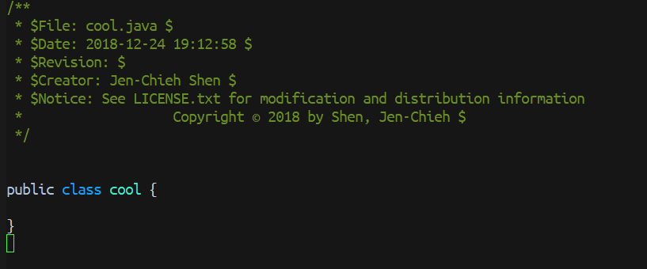

[](https://www.gnu.org/licenses/gpl-3.0)
[](https://celpa.conao3.com/#/file-header)
[](https://jcs-emacs.github.io/jcs-elpa/#/file-header)

# file-header
> Highly customizable self-design file header.

[](https://github.com/jcs-elpa/file-header/actions/workflows/test.yml)

## Usage

### 🔍 Step 1.

First, you need to set the template config file path.
```el
(setq file-header-template-config-filepath "~/.emacs.jcs/template/template_config.properties")
```

### 🔍 Step 2.

Then create the config file to the directory where you just set it. The config file 
the example can be found under `Config Example` section below.

### 🔍 Step 3.

Create the template file and design it. The template file example can be found under 
`Templates Example` section below.

### 🔍 Step 4.

Lastly, you can define your own insert template function by calling `file-header-insert-template-by-file-path` 
bypassing the template file path.

Example function that insert the Java template. You can either set 
interactive or not interactive depends on your usage.

```el
(defun insert-java-template ()
  "Insert the template for Java file."
  (interactive)
  (file-header-insert-template-by-file-path "~/.emacs.d/template/java/java_template.txt"))
```

You can bind it to any `mode-hook' so every time you created a file, 
the template will be inserted.

```el
(add-hook 'java-mode-hook
              (lambda ()
                ;; Insert the template once a .java file created.
                (insert-java-template))
```

### Screenshot

Here is the result after I created `cool.java` file.



## Config Example

Here is the minimal config example. Functions below like `(buffer-file-name)`, `(format-time-string "%Y")`, etc, 
are for demonstration purposes and not included inside this package. You would need 
to define these functions on your own somewhere in your emacs configuration.

```ini
# Author related
CREATOR_NAME=`user-full-name`

# File related
FILE_NAME=`buffer-file-name`
FILE_NAME_NO_EXT=`(file-name-sans-extension buffer-file-name)`

# Time
TIME_STAMP=`(format-time-string "%Y-%m-%d %H:%M:%S")`
TIME_YEAR=`(format-time-string "%Y")`
```

There are two ways to assign value in the config file.

* Assign property with value directly. e.g. `CREATOR_NAME=Jen-Chieh Shen`.
* Assign property to a lisp function that returns a string. e.g. ``TIME_STAMP=`(format-time-string "%Y-%m-%d %H:%M:%S")` ``.

## Templates Example

This is the minimal template example for a Java file. The full example 
can be found [here](https://github.com/jcs090218/jcs-emacs-init/tree/master/.emacs.jcs/template).

```java
/**
 * $File: #FILE_NAME# $
 * $Date: #TIME_STAMP# $
 * $Revision: $
 * $Creator: #CREATOR_NAME# $
 * $Notice: See LICENSE.txt for modification and distribution information
 *                   Copyright © #TIME_YEAR# by #COPYRIGHT_INFO# $
 */


public class #FILE_NAME_NO_EXT# {

}
```

## Contribute

[](http://makeapullrequest.com)
[](https://github.com/bbatsov/emacs-lisp-style-guide)
[](https://www.paypal.me/jcs090218)
[](https://www.patreon.com/jcs090218)

If you would like to contribute to this project, you may either 
clone or make pull requests to this repository. Or you can 
clone the project and establish your own branch of this tool. 
Any methods are welcome!
